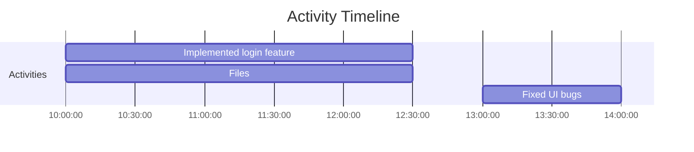

# Activity Tracker

A Visual Studio Code extension to track time spent on project activities, log modified files (optional), and visualize activities with Mermaid.js Gantt diagrams.


## Overview

Activity Tracker helps you monitor how much time you spend on different tasks during development. It tracks:

- Time spent on activities
- Files modified during each activity (optional)
- Creates visual Gantt charts to represent your work timeline

Perfect for freelancers, teams that need to report time spent, or developers who want insights into their work patterns.

## Features

- **Timer Management**: Start, pause, and stop a timer using colored buttons in the Status Bar (Play, Pause, Stop)
- **Time Display**: Shows elapsed time in the Status Bar (e.g., `Timer: 00:15:32`) while the timer is running
- **File Change Tracking**: Automatically detects modified files during an activity
- **Activity Logging**: Add custom descriptions for each activity period
- **Activity Management**: View, edit, and delete activity logs
- **Visualization**: Display a Gantt chart diagram of activities using Mermaid.js
- **Persistent Storage**: Store logs in a JSON file (`.vscode/activity-log.json`)

## Status Bar Controls

The extension provides easy-to-use controls in the VS Code status bar:

- **Green Play Button (▶)**: Start or resume the timer
- **Yellow Pause Button (⏸)**: Pause the current timer
- **Red Stop Button (⏹)**: Stop the timer and log the activity

## Commands

All functionality is available through the Command Palette (`Ctrl+Shift+P` or `Cmd+Shift+P`):

- `Activity Tracker: Start Timer`: Start the timer for a new activity
- `Activity Tracker: Pause Timer`: Pause the current timer
- `Activity Tracker: Stop Timer`: Stop the timer and log the activity
- `Activity Tracker: View Logs`: Display all logged activities in a webview
- `Activity Tracker: Edit Log`: Modify the description of an existing activity
- `Activity Tracker: Delete Log`: Remove an activity log
- `Activity Tracker: Delete All Logs`: Remove all activity logs after confirmation
- `Activity Tracker: Show Activity Diagram`: Display a Mermaid.js Gantt diagram of activities

## Installation

### From VSIX

1. Download the `.vsix` file from the releases section
2. In VS Code, go to Extensions view (`Ctrl+Shift+X` or `Cmd+Shift+X`)
3. Click the "..." menu at the top and select "Install from VSIX..."
4. Choose the downloaded file

### From Source

1. Clone the repository
2. Run `npm install` to install dependencies
3. Package the extension with `vsce package`
4. Install the generated VSIX file as above

## Usage

1. Open a workspace in VS Code
2. Click the play button (▶) in the status bar or run `Activity Tracker: Start Timer` command
3. Work on your tasks, the extension will track time and modified files
4. When finished, click the stop button (⏹) or run `Activity Tracker: Stop Timer`
5. Enter a description of your activity
6. Choose whether to include modified files in the log
7. View logs with the `Activity Tracker: View Logs` command
8. Generate a timeline diagram with `Activity Tracker: Show Activity Diagram`

## Data Storage

All activity data is stored in `.vscode/activity-log.json` in your workspace directory. The format is:

```json
{
  "activities": [
    {
      "id": "1715680200000",
      "startTime": "2025-05-12T19:00:00.000Z",
      "endTime": "2025-05-13T01:05:00.000Z",
      "duration": 21900,
      "description": "Implemented feature X",
      "filesModified": ["src/components/feature.js", "src/styles/feature.css"],
      "includeFiles": true
    }
  ]
}
```

## Example Diagram



## Additional Features

### Notifications

- The extension sends periodic notifications to remind you that the timer is active. The interval can be configured in the settings.

### Tags and Categories

- You can now add tags to activities for categorization and filter activities by tags.

## Advanced Configuration

The extension provides the following configurable settings:

- **`activity-tracker.timerUpdateInterval`**: Interval (in minutes) for periodic notifications. Default is 15 minutes.
- **`activity-tracker.timeFormat`**: Format of time display (`12h` or `24h`). Default is `24h`.
- **`activity-tracker.language`**: Language of the interface. Default is `en` (English).

## Versioning and Packaging

### Automatic Version Increment

The extension now automatically increments the version number in `package.json` before packaging. This ensures that each package has a unique version.

### Packaging the Extension

1. Run the following command to package the extension:
   ```bash
   npm run prepackage && vsce package
   ```
2. This will:
   - Increment the patch version in `package.json`.
   - Generate a `.vsix` file for the extension.

### Installing the Packaged Extension

1. After packaging, install the `.vsix` file:
   - Open the Extensions view in VS Code (`Ctrl+Shift+X` or `Cmd+Shift+X`).
   - Click the `...` menu and select `Install from VSIX...`.
   - Choose the generated `.vsix` file.

### Local Mermaid.js Support

If there is no internet connection, the extension will use a local version of `mermaid.min.js` located in the `local/` directory. Ensure the file is present for offline functionality.

## Requirements

- Visual Studio Code 1.85.0 or higher

## Extension Settings

The extension provides the following configurable settings:

- **`activity-tracker.buttonAlignment`**: Determines the alignment of the status bar buttons (e.g., `Left` or `Right`). Default is `Left`.

## Known Issues

- Large file paths might cause rendering issues in Mermaid diagrams (fixed in this version)
- Diagrams may not render correctly in certain themes or with certain extensions installed

## Troubleshooting

If you encounter issues:

1. Check the VS Code Developer Tools console for error messages
2. Ensure you have opened a workspace (extension requires a workspace to store log files)
3. If diagrams fail to render, try using simpler activity descriptions without special characters

## Roadmap

Future improvements planned:

- Configurable settings for timer behavior
- Export of activities to CSV/Excel formats
- Integration with project management tools
- Tags/categories for activities
- Enhanced activity deletion options with undo functionality

## License

This project is licensed under a Non-Commercial License - see the [LICENSE](LICENSE) file for details. You are free to use, modify, and distribute this extension for non-commercial purposes only.

## Contributors

Currently maintained by the Activity Tracker team. Contributions are welcome!
